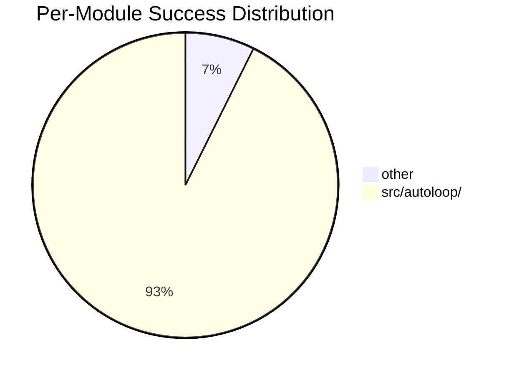

# EVAL Report

## Overall

| Metric | Value |
|--------|-------|
| First-attempt success | 58% |
| Avg cost/PR | $1.44 |
| Human edit rate | 15% |

## Per-Module Breakdown

| Module | Success | Avg Cost | PRs | Auto-merge ready? |
|--------|---------|----------|-----|--------------------|
| other | 40% | $0.48 | 5 | No |
| src/autoloop/ | 71% | $1.24 | 63 | No |

## Trend

| Date | Implementations | First-attempt | Avg Cost | Human Edits |
|------|----------------|---------------|----------|-------------|
| 2026-09-18 | 125 | 58% | $1.44 | 15% |

```mermaid
xychart-beta
    title "First-Attempt Success Rate"
    x-axis ["2026-09-18"]
    y-axis "Success %" 0 --> 100
    line [58]
```

```mermaid
xychart-beta
    title "Avg Cost/PR"
    x-axis ["2026-09-18"]
    y-axis "Cost ($)"
    line [1.44]
```


