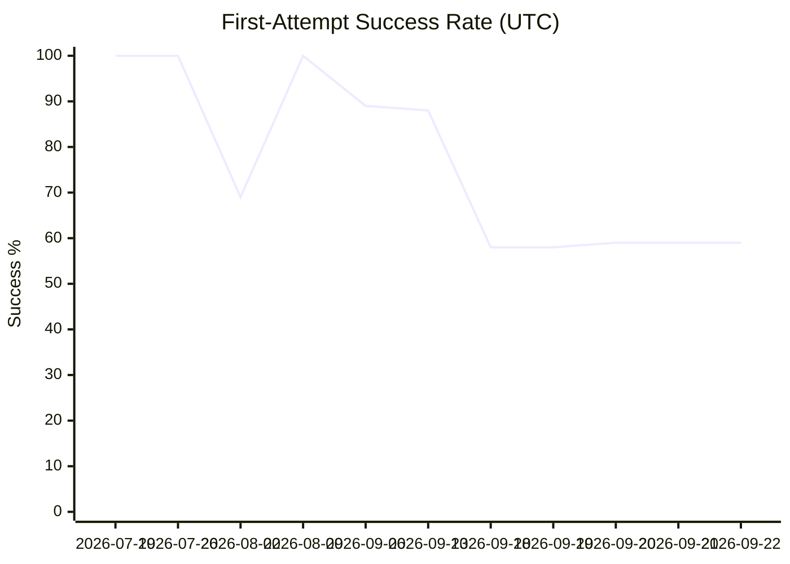
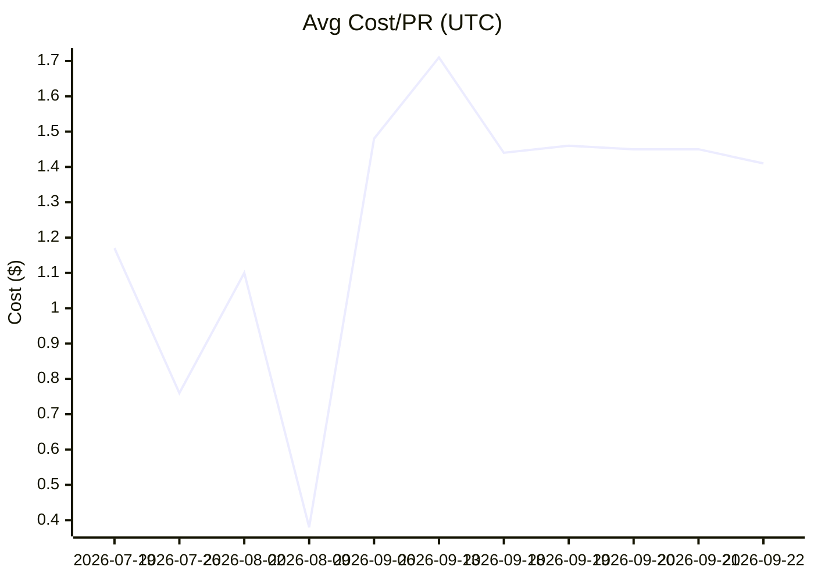
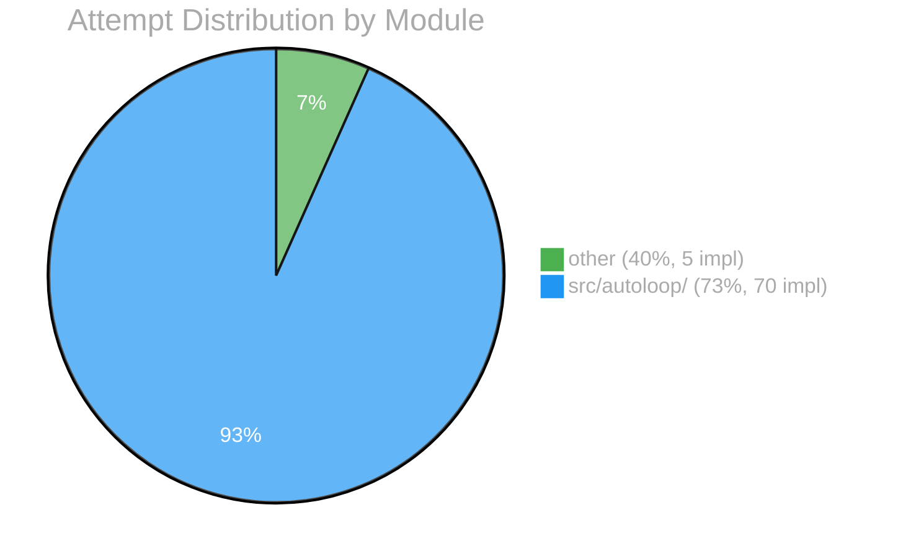

# EVAL Report

## Overall

| Metric | Value |
|--------|-------|
| First-attempt success | 59% |
| Avg cost/PR | $1.41 |
| Human edit rate | 14% |

## Per-Module Breakdown

| Module | Success | Avg Cost | Impl | Auto-merge ready? |
|--------|---------|----------|------|--------------------|
| other | 40% | $0.48 | 5 | No |
| src/autoloop/ | 73% | $1.27 | 70 | No |

## Trend

| Date (UTC) | Implementations | First-attempt | Avg Cost | Human Edits |
|------|----------------|---------------|----------|-------------|
| 2026-07-19 | 1 | 100% | $1.17 | 0% |
| 2026-07-26 | 6 | 100% | $0.76 | 0% |
| 2026-08-02 | 13 | 69% | $1.10 | 0% |
| 2026-08-09 | 1 | 100% | $0.38 | 0% |
| 2026-09-06 | 9 | 89% | $1.48 | 0% |
| 2026-09-13 | 8 | 88% | $1.71 | 0% |
| 2026-09-18 | 125 | 58% | $1.44 | 15% |
| 2026-09-19 | 130 | 58% | $1.46 | 15% |
| 2026-09-20 | 132 | 59% | $1.45 | 15% |
| 2026-09-21 | 132 | 59% | $1.45 | 15% |
| 2026-09-22 | 140 | 59% | $1.41 | 14% |

