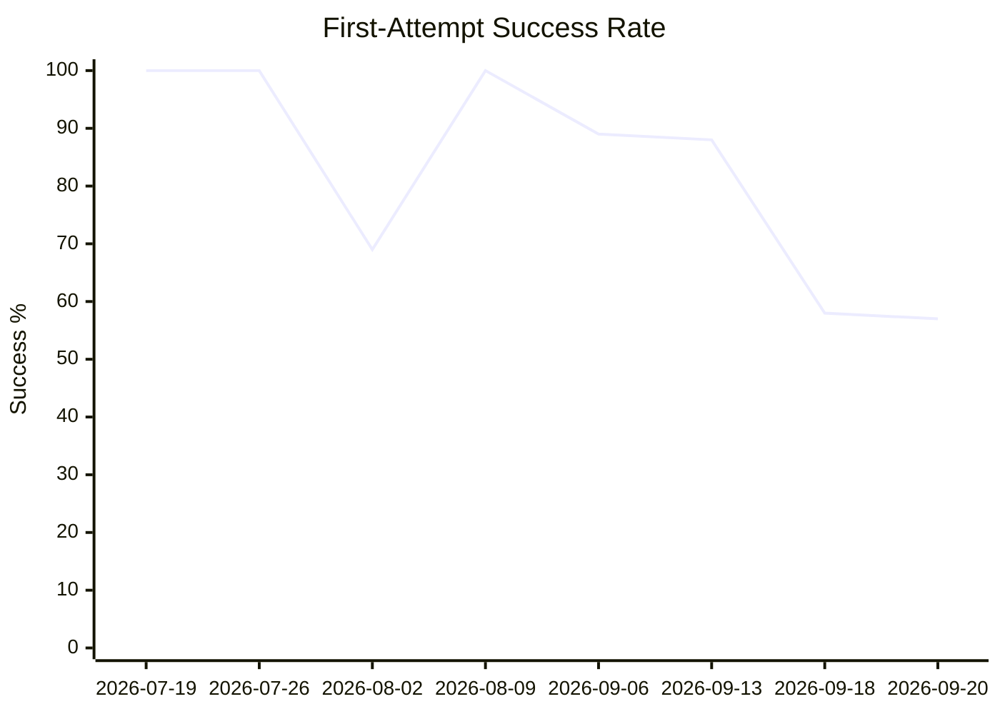
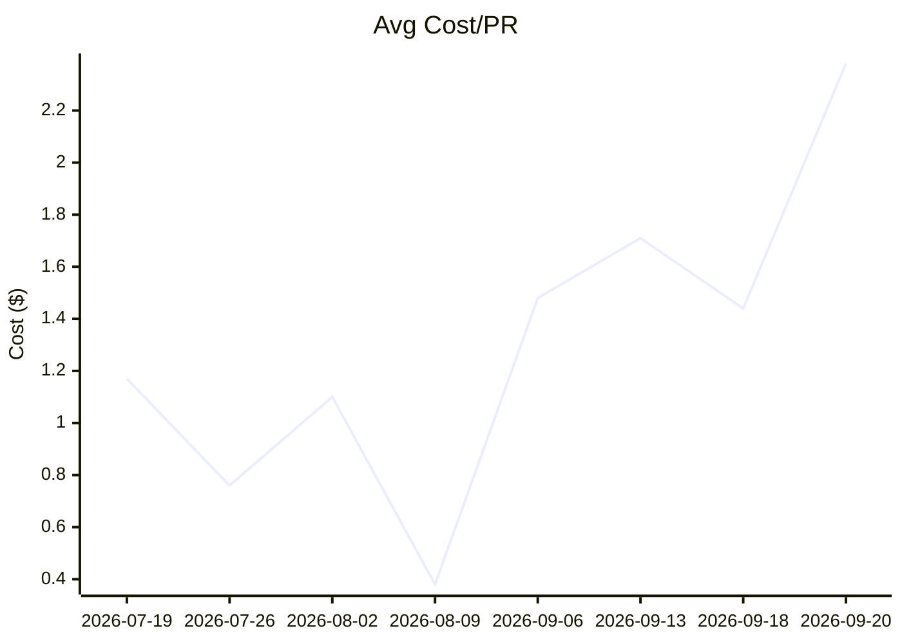
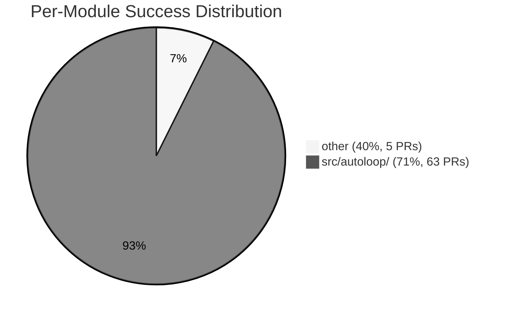

# EVAL Report

## Overall

| Metric | Value |
|--------|-------|
| First-attempt success | 58% |
| Avg cost/PR | $1.44 |
| Human edit rate | 15% |

## Per-Module Breakdown

| Module | Success | Avg Cost | PRs | Auto-merge ready? |
|--------|---------|----------|-----|--------------------|
| other | 40% | $0.48 | 5 | No |
| src/autoloop/ | 71% | $1.24 | 63 | No |

## Trend

| Date | Implementations | First-attempt | Avg Cost | Human Edits |
|------|----------------|---------------|----------|-------------|
| 2026-07-19 | 1 | 100% | $1.17 | 0% |
| 2026-07-26 | 6 | 100% | $0.76 | 0% |
| 2026-08-02 | 13 | 69% | $1.10 | 0% |
| 2026-08-09 | 1 | 100% | $0.38 | 0% |
| 2026-09-06 | 9 | 89% | $1.48 | 0% |
| 2026-09-13 | 8 | 88% | $1.71 | 0% |
| 2026-09-18 | 125 | 58% | $1.44 | 15% |
| 2026-09-20 | 53 | 57% | $2.38 | 0% |

