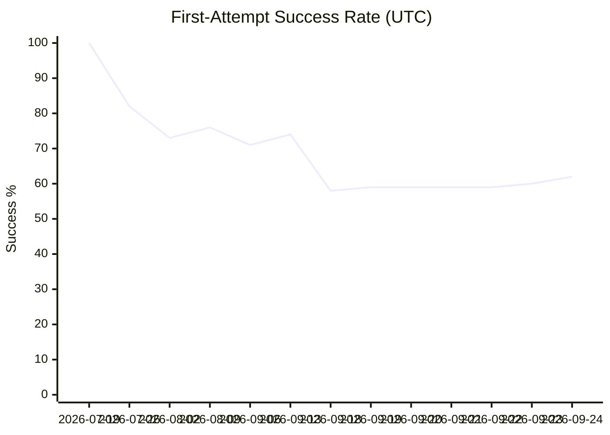
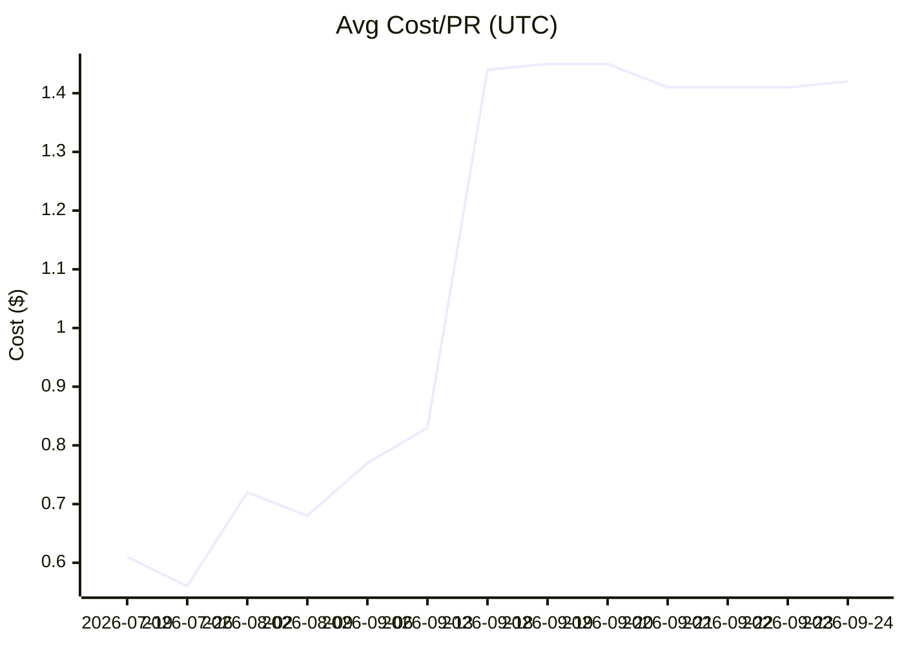

# EVAL Report

## Overall

| Metric | Value |
|--------|-------|
| First-attempt success | 62% |
| Avg cost/PR | $1.42 |
| Human edit rate | 13% |

## Per-Module Breakdown

| Module | Success | Avg Cost | Impl | Auto-merge ready? |
|--------|---------|----------|------|--------------------|
| other | 40% | $0.48 | 5 | No |
| src/autoloop/ | 74% | $1.40 | 77 | No |

## Trend

| Date (UTC) | Implementations | First-attempt | Avg Cost | Human Edits |
|------|----------------|---------------|----------|-------------|
| 2026-07-19 | 12 | 100% | $0.61 | 8% |
| 2026-07-26 | 6 | 82% | $0.56 | 6% |
| 2026-08-02 | 12 | 73% | $0.72 | 13% |
| 2026-08-09 | 2 | 76% | $0.68 | 16% |
| 2026-09-06 | 7 | 71% | $0.77 | 15% |
| 2026-09-13 | 7 | 74% | $0.83 | 15% |
| 2026-09-18 | 19 | 58% | $1.44 | 15% |
| 2026-09-19 | 3 | 59% | $1.45 | 15% |
| 2026-09-20 | 0 | 59% | $1.45 | 15% |
| 2026-09-21 | 4 | 59% | $1.41 | 14% |
| 2026-09-22 | 2 | 59% | $1.41 | 14% |
| 2026-09-23 | 0 | 60% | $1.41 | 14% |
| 2026-09-24 | 4 | 62% | $1.42 | 13% |

