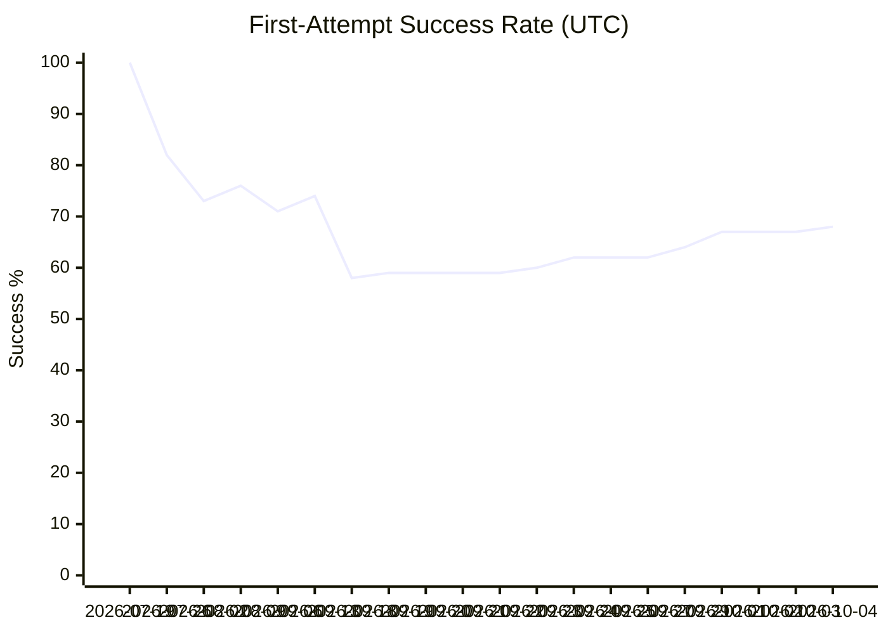
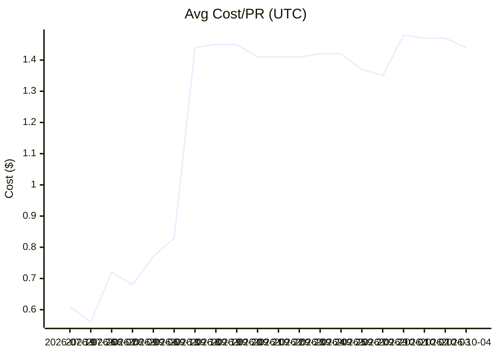
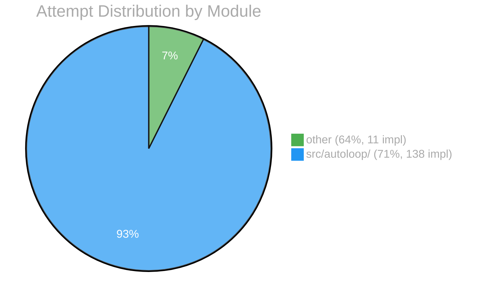

# EVAL Report

## Overall

| Metric | Value |
|--------|-------|
| First-attempt success | 68% |
| Avg cost/PR | $1.44 |
| Human edit rate | 51% |

## Per-Module Breakdown

| Module | Success | Avg Cost | Impl | Auto-merge ready? |
|--------|---------|----------|------|--------------------|
| other | 64% | $0.51 | 11 | No |
| src/autoloop/ | 71% | $1.62 | 138 | No |

## Trend

| Date (UTC) | Implementations | First-attempt | Avg Cost | Human Edits |
|------|----------------|---------------|----------|-------------|
| 2026-07-19 | 12 | 100% | $0.61 | 8% |
| 2026-07-26 | 6 | 78% | $0.55 | 0% |
| 2026-08-02 | 12 | 68% | $0.81 | 25% |
| 2026-08-09 | 2 | 100% | $0.28 | 50% |
| 2026-09-06 | 7 | 60% | $0.97 | 14% |
| 2026-09-13 | 7 | 86% | $1.04 | 14% |
| 2026-09-18 | 19 | 56% | $2.04 | 16% |
| 2026-09-19 | 3 | 71% | $1.63 | 0% |
| 2026-09-20 | 0 | — | — | — |
| 2026-09-21 | 4 | 88% | $0.75 | 0% |
| 2026-09-22 | 2 | 67% | $1.41 | 0% |
| 2026-09-23 | 0 | 100% | $1.41 | — |
| 2026-09-24 | 4 | 100% | $1.66 | 0% |
| 2026-09-25 | 0 | — | — | — |
| 2026-09-27 | 9 | 62% | $0.79 | 22% |
| 2026-09-29 | 23 | 77% | $1.26 | 196% |
| 2026-10-01 | 19 | 85% | $2.44 | 0% |
| 2026-10-02 | 2 | 100% | $0.34 | 150% |
| 2026-10-03 | 2 | 0% | $1.47 | — |
| 2026-10-04 | 6 | 100% | $0.07 | 138% |

```mermaid
xychart-beta
    title "First-Attempt Success Rate (UTC)"
    x-axis ["2026-07-19", "2026-07-26", "2026-08-02", "2026-08-09", "2026-09-06", "2026-09-13", "2026-09-18", "2026-09-19", "2026-09-20", "2026-09-21", "2026-09-22", "2026-09-23", "2026-09-24", "2026-09-25", "2026-09-27", "2026-09-29", "2026-10-01", "2026-10-02", "2026-10-03", "2026-10-04"]
    y-axis "Success %" 0 --> 100
    line [100, 82, 73, 76, 71, 74, 58, 59, 59, 59, 59, 60, 62, 62, 62, 64, 67, 67, 67, 68]
```

```mermaid
xychart-beta
    title "Avg Cost/PR (UTC)"
    x-axis ["2026-07-19", "2026-07-26", "2026-08-02", "2026-08-09", "2026-09-06", "2026-09-13", "2026-09-18", "2026-09-19", "2026-09-20", "2026-09-21", "2026-09-22", "2026-09-23", "2026-09-24", "2026-09-25", "2026-09-27", "2026-09-29", "2026-10-01", "2026-10-02", "2026-10-03", "2026-10-04"]
    y-axis "Cost ($)"
    line [0.61, 0.56, 0.72, 0.68, 0.77, 0.83, 1.44, 1.45, 1.45, 1.41, 1.41, 1.41, 1.42, 1.42, 1.37, 1.35, 1.48, 1.47, 1.47, 1.44]
```

```mermaid
%%{init: {'theme': 'base', 'themeVariables': {'pie1': '#4CAF50', 'pie2': '#2196F3', 'pie3': '#FF9800', 'pie4': '#E91E63', 'pie5': '#9C27B0', 'pie6': '#00BCD4', 'pieTitleTextColor': '#aaa', 'pieLegendTextColor': '#aaa', 'pieSectionTextColor': '#fff'}}}%%
pie title Attempt Distribution by Module
    "other (64%, 11 impl)" : 11
    "src/autoloop/ (71%, 138 impl)" : 138
```
