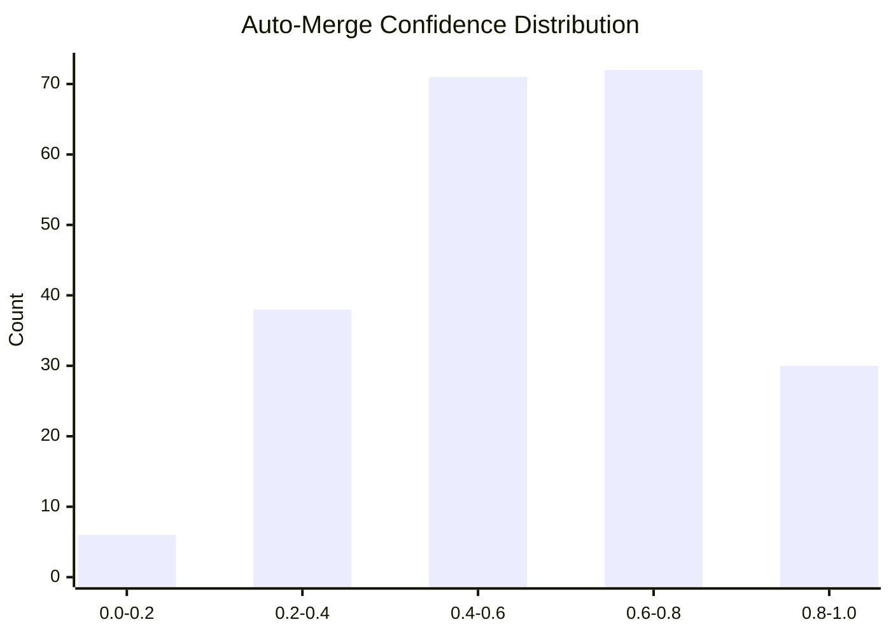
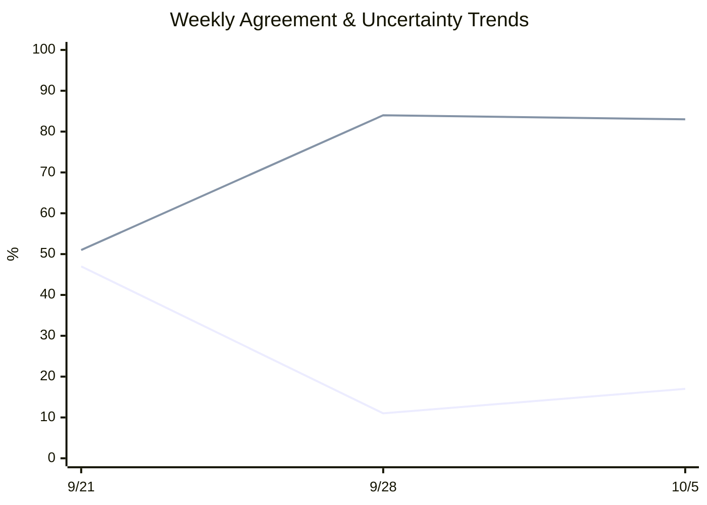

# JEV Report

## Counts

- **Total entries:** 343
- **Live entries:** 264
- **Backfilled entries:** 79
- **Date range:** 2026-07-17 to 2026-10-05

## Triage Calibration

- **Agreement rate:** 30.4%
- **Uncertainty rate:** 66.3%
- **Disagreement breakdown:**
  - ready-vs-rejected: 3

## Auto-Merge Calibration

- **Mean confidence:** 0.569
- **Median confidence:** 0.580
- **Agreement with outcome:** 70.8%

