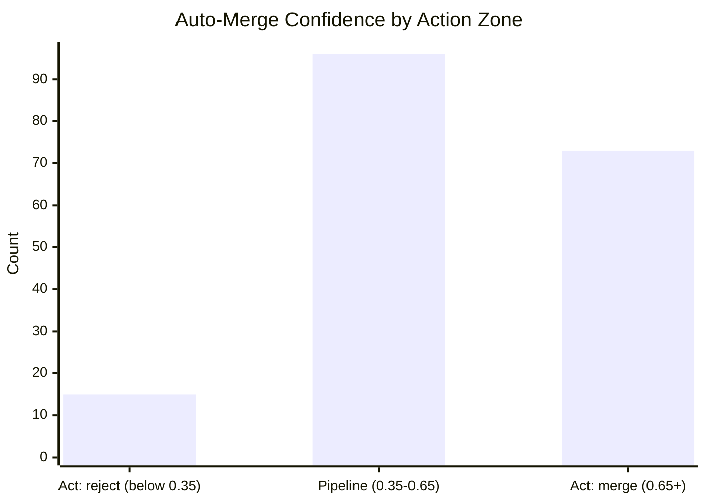
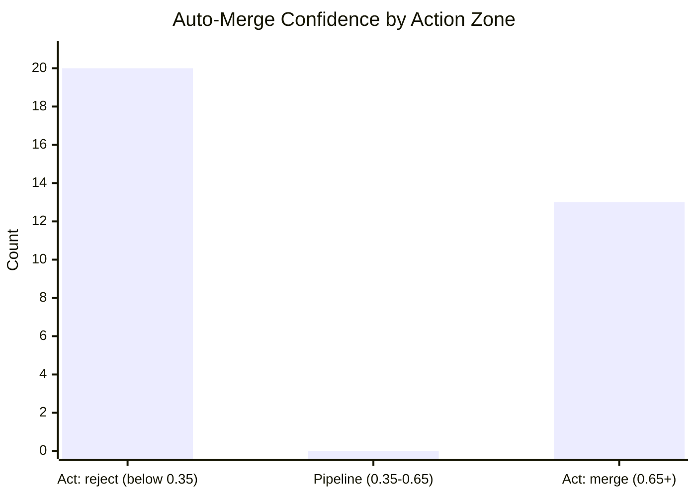

# JEV Report

## Counts

- **Total entries:** 343
- **Live entries:** 264
- **Backfilled entries:** 79
- **Date range:** 2026-07-17 to 2026-10-05

## Triage Agreement

- **Agreed:** 6 of 64
- **Disagreed:** 3 of 64
- **Uncertain (fell back):** 55 of 64
- **When confident, agreed:** 6 of 9 (66.7%)
- **Disagreement breakdown:**
  - ready-vs-rejected: 3

### Weekly Trends

| Week | Agreed | Uncertain | n |
|------|--------|-----------|---|
| 9/21 | 1 | 19 | 21 |
| 9/28 | 4 | 31 | 37 |
| 10/5 | 1 | 5 | 6 |

## Auto-Merge Agreement

- **Mean confidence:** 0.588 (n=184)
- **Median confidence:** 0.590 (n=184)
- **Agreement with incumbent decision:** 70.8% (34/48)

## Backfill

### Backfill Triage Agreement

- **Agreed:** 22 of 28
- **Disagreed:** 0 of 28
- **Uncertain (fell back):** 6 of 28
- **When confident, agreed:** 22 of 22 (100.0%)

### Weekly Trends

| Week | Agreed | Uncertain | n |
|------|--------|-----------|---|
| 9/21 | 22 | 6 | 28 |

### Backfill Auto-Merge Agreement

- **Mean confidence:** 0.459 (n=33)
- **Median confidence:** 0.330 (n=33)
- **Agreement with incumbent decision:** 0.0% (0/0)

